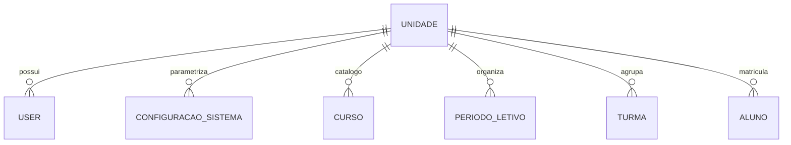
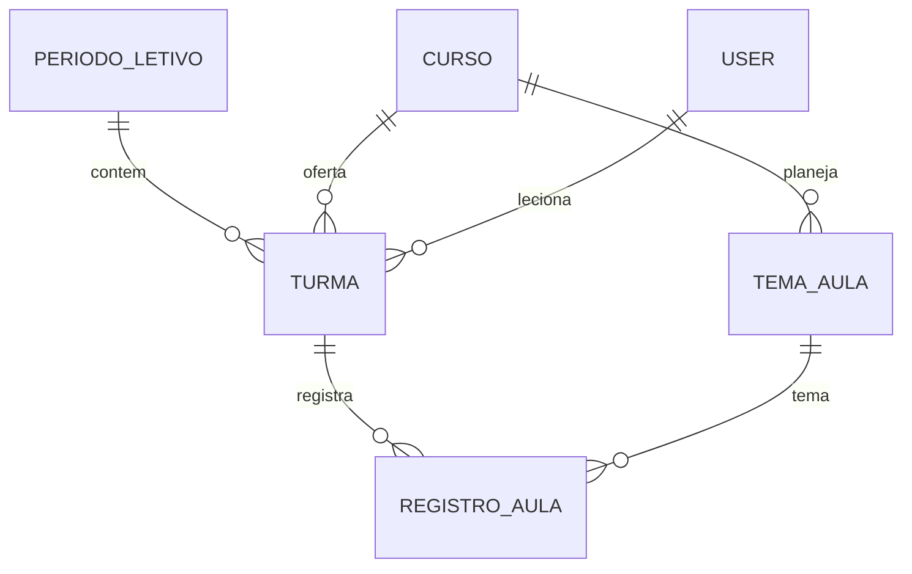
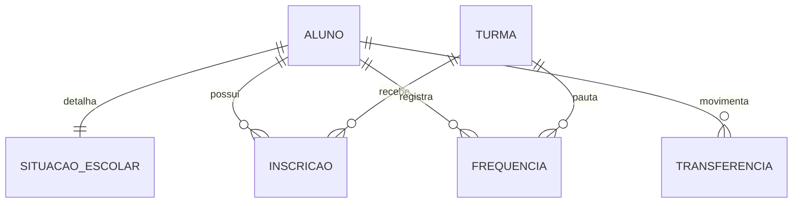
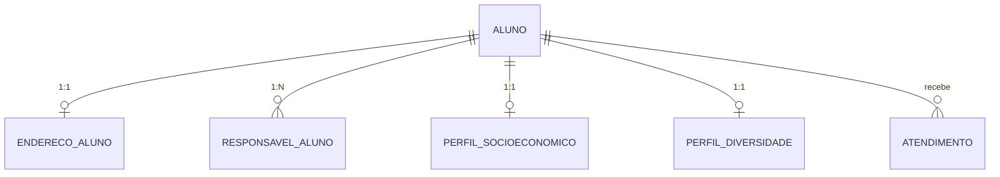
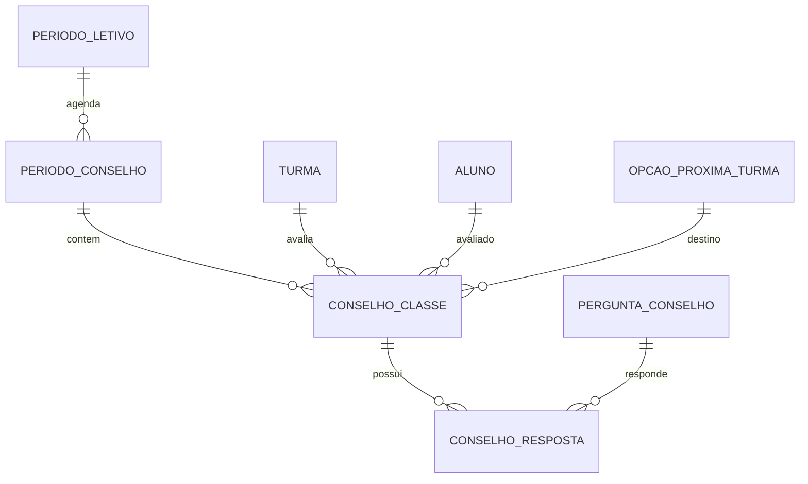
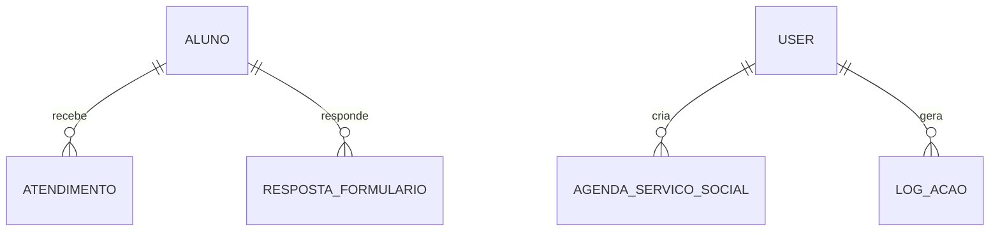

# MER — Modelo Entidade-Relacionamento

> Documento vivo do esquema do banco de dados. **Atualize sempre que criar,
> alterar ou remover uma tabela/coluna.** Cada alteração deve vir acompanhada
> da migration correspondente.

**Última atualização:** 2026-09-17 — Onda 3B concluída (JSONs do Aluno →
tabelas estruturadas).

---

## Sumário

1. [Visão geral](#1-visão-geral)
2. [Estrutura do pacote de modelos](#2-estrutura-do-pacote-de-modelos)
3. [Glossário](#3-glossário)
4. [Multitenancy](#4-multitenancy)
5. [Mapa de domínios](#5-mapa-de-domínios)
6. [Diagramas ER por domínio](#6-diagramas-er-por-domínio)
7. [Dicionário de dados](#7-dicionário-de-dados)
8. [Regras de negócio transversais](#8-regras-de-negócio-transversais)
9. [Convenções de código](#9-convenções-de-código)
10. [Histórico de ondas](#10-histórico-de-ondas)
11. [Referência cruzada com migrations](#11-referência-cruzada-com-migrations)
12. [Dívida técnica e roadmap](#12-dívida-técnica-e-roadmap)

---

## 1. Visão geral

O sistema é um **ERP socioeducativo** multitenant, organizado em torno de
**unidades** (tenants). Cada unidade possui:

- Usuários próprios (professores, pedagogia, secretaria).
- Catálogo próprio de cursos, níveis e turmas.
- Períodos letivos, calendário e conselhos de classe.
- Alunos, seus perfis estruturados (socioeconômico, diversidade, endereço,
  responsáveis) e atendimentos.

**Banco:** PostgreSQL (produção) / SQLite (testes locais).
**ORM:** SQLAlchemy via Flask-SQLAlchemy.
**Migrations:** Alembic via Flask-Migrate.
**Fonte de verdade do código:** `app/models/` (pacote).
**Fonte de verdade do esquema:** este documento.

---

## 2. Estrutura do pacote de modelos

```text
app/models/
├── __init__.py            # Reexporta tudo (compatibilidade)
├── base.py                # Imports, JSONType, convenções (não define modelos)
├── enums.py               # Enumerações + conjuntos derivados
├── organizacao.py         # Unidade, ConfiguracaoSistema
├── usuarios.py            # User
├── pedagogico.py          # Curso, Nivel
├── academico.py           # PeriodoLetivo, Turma, TemaAula
├── pessoas.py             # Aluno, SituacaoEscolar
├── perfis.py              # EnderecoAluno, ResponsavelAluno,
│                          # PerfilSocioeconomico, PerfilDiversidade
├── matriculas.py          # Inscricao, Transferencia
├── calendario.py          # DiaBloqueado, DiaBloqueadoTurma
├── aulas.py               # Frequencia, RegistroAula
├── conselho.py            # PeriodoConselho, PerguntaConselho,
│                          # OpcaoProximaTurma, ConselhoClasse, ConselhoResposta
├── atendimento.py         # Atendimento
├── servico_social.py      # AgendaServicoSocial, RespostaFormulario
├── auditoria.py           # LogAcao
└── legado.py              # Registro
```

### Camada de serviços relacionada

```text
app/services/
├── aluno_perfil.py        # Centraliza leitura/escrita dos perfis do Aluno
│                          # (Onda 3B). Todo acesso a endereço/responsável/
│                          # socioeconômico/diversidade passa por aqui.
├── auth_service.py
├── bootstrap.py
└── calendar_service.py
```

### Regras de importação

1. Código **fora** do pacote importa sempre de `app.models`.
2. Código **dentro** do pacote importa pelo caminho completo
   (ex.: `from app.models.pessoas import Aluno`).
3. Dentro de **métodos**, usar import local para evitar ciclos.
4. Ao ler/escrever dados de perfil do aluno, usar **sempre**
   `app.services.aluno_perfil` — nunca acessar `aluno.*_json` direto.

---

## 3. Glossário

| Termo | Significado |
|---|---|
| **Unidade** | Tenant do sistema. Fronteira de isolamento de dados. |
| **Turma** | Agrupamento operacional de alunos em um curso/período. |
| **Inscrição** | Vínculo N:N entre Aluno e Turma, com histórico. |
| **Conceito** | Código de presença/falta: A/B/C/D (presente), F (falta), J (justificada). |
| **Conselho de Classe** | Reunião colegiada que avalia aluno/turma por etapa. |
| **Etapa** | Momento do conselho: INICIAL, PERCURSO, FINAL. |
| **Tema de Aula** | Tópico macro do planejamento pedagógico. |
| **Dia bloqueado** | Data sem aula em um período letivo (feriado, etc.). |
| **Perfil do aluno** | Dados complementares (endereço, responsável, socioeconômico, diversidade) em tabelas 1:1 ou 1:N com `Aluno`. |
| **Documentos entregues** | Flags JSONB em `Aluno.documentos_entregues` indicando quais documentos foram anexados. |

---

## 4. Multitenancy

A coluna **`unidade_id`** aparece em quase todas as tabelas de negócio.

Regras:

1. **Toda consulta de listagem deve filtrar por `unidade_id`** do usuário
   logado, exceto para o perfil `admin` global.
2. `Unidade` **não** é apagada se houver registros dependentes (integridade).
3. `User.email` é único **globalmente** (não por unidade).
4. `ConfiguracaoSistema.unidade_id = NULL` significa configuração **global**.
5. `Nivel.nome` é único **globalmente** hoje (dívida técnica).
6. As tabelas de perfil do aluno (`endereco_aluno`, `responsavel_aluno`,
   `perfil_socioeconomico`, `perfil_diversidade`) herdam `unidade_id` do
   aluno no momento da criação.

---

## 5. Mapa de domínios

| Módulo | Domínio | Entidades |
|---|---|---|
| `organizacao` | Estrutura Organizacional | `Unidade`, `ConfiguracaoSistema` |
| `usuarios` | Usuários e Autenticação | `User` |
| `pedagogico` | Cadastros Pedagógicos | `Curso`, `Nivel` |
| `academico` | Estrutura Acadêmica | `PeriodoLetivo`, `Turma`, `TemaAula` |
| `pessoas` | Pessoas | `Aluno`, `SituacaoEscolar` |
| `perfis` | Perfis do Aluno | `EnderecoAluno`, `ResponsavelAluno`, `PerfilSocioeconomico`, `PerfilDiversidade` |
| `matriculas` | Matrículas e Movimentações | `Inscricao`, `Transferencia` |
| `calendario` | Calendário Acadêmico | `DiaBloqueado`, `DiaBloqueadoTurma` |
| `aulas` | Frequência e Aulas | `Frequencia`, `RegistroAula` |
| `conselho` | Conselho de Classe | `PeriodoConselho`, `PerguntaConselho`, `OpcaoProximaTurma`, `ConselhoClasse`, `ConselhoResposta` |
| `atendimento` | Atendimento | `Atendimento` |
| `servico_social` | Serviço Social | `AgendaServicoSocial`, `RespostaFormulario` |
| `auditoria` | Auditoria | `LogAcao` |
| `legado` | Legado | `Registro` |

---

## 6. Diagramas ER por domínio

### 6.1 Núcleo organizacional e usuários



### 6.2 Estrutura acadêmica



### 6.3 Alunos, matrículas e frequência



### 6.4 Perfil do aluno (Onda 3A/3B)



### 6.5 Conselho de classe



### 6.6 Serviço social, atendimento e auditoria



---

## 7. Dicionário de dados

> Tipos lógicos. `NOT NULL` indicado explicitamente. Defaults descritos
> quando relevantes.

### 7.1 `unidade`

| Coluna | Tipo | Nulo | Default | Descrição |
|---|---|---|---|---|
| id | int | não | auto | PK |
| nome | varchar(100) | não | — | Nome da unidade |
| ativo | bool | não | true | Soft delete |

### 7.2 `configuracao_sistema`

| Coluna | Tipo | Nulo | Default | Descrição |
|---|---|---|---|---|
| id | int | não | auto | PK |
| chave | varchar(50) | não | — | Chave (única por escopo) |
| valor | varchar(100) | sim | — | Valor serializado |
| descricao | varchar(255) | sim | — | Texto explicativo |
| unidade_id | int | sim | — | NULL = global |

**Índices únicos parciais:** `ix_config_chave_global` (`chave WHERE unidade_id IS NULL`), `ix_config_chave_unidade` (`chave, unidade_id WHERE unidade_id IS NOT NULL`).

### 7.3 `user`

| Coluna | Tipo | Nulo | Default | Descrição |
|---|---|---|---|---|
| id | int | não | auto | PK |
| name | varchar(100) | não | — | Nome completo |
| email | varchar(120) | não | — | **UNIQUE** global |
| password | varchar(200) | sim | — | Hash Werkzeug; NULL para AD |
| role | varchar(20) | não | — | Valor canônico em `UserRole` |
| is_active | bool | não | true | Conta ativa |
| is_ad_user | bool | não | false | Autenticação por domínio |
| unidade_id | int | sim | — | FK → unidade |
| first_login | bool | sim | true | Força troca de senha |
| google_id | varchar(100) | sim | — | **UNIQUE**, indexado |
| google_email | varchar(120) | sim | — | E-mail Google |

**CHECK:** `ck_user_role` — restringe `role` aos valores de `UserRole`.

### 7.4 `curso`

| Coluna | Tipo | Nulo | Default | Descrição |
|---|---|---|---|---|
| id | int | não | auto | PK |
| nome | varchar(150) | não | — | Nome do curso |
| descricao | varchar(300) | sim | — | Descrição |
| carga_horaria | int | sim | — | Horas previstas |
| ativo | bool | não | true | Soft delete |
| unidade_id | int | não | — | FK → unidade |
| created_at | timestamp | sim | now | Auditoria |

### 7.5 `nivel`

| Coluna | Tipo | Nulo | Default | Descrição |
|---|---|---|---|---|
| id | int | não | auto | PK |
| nome | varchar(100) | não | — | **UNIQUE** global |
| ativo | bool | não | true | Soft delete |
| unidade_id | int | sim | — | FK → unidade |

### 7.6 `periodo_letivo`

| Coluna | Tipo | Nulo | Default | Descrição |
|---|---|---|---|---|
| id | int | não | auto | PK |
| nome | varchar(150) | não | — | Nome |
| data_inicio | date | não | — | Início |
| data_fim | date | não | — | Fim |
| centro_custo | varchar(150) | sim | — | Centro de custo |
| estimativa_alunos | int | não | 0 | Planejamento |
| ativo | bool | não | true | Soft delete |
| unidade_id | int | não | — | FK → unidade |
| created_at | timestamp | sim | now | Auditoria |
| updated_at | timestamp | sim | onupdate | Auditoria |

### 7.7 `turma`

| Coluna | Tipo | Nulo | Default | Descrição |
|---|---|---|---|---|
| id | int | não | auto | PK |
| nome | varchar(100) | não | — | Nome |
| ativo | bool | não | true | Soft delete |
| **data_inicio** | **date** | sim | — | Início (Onda 2A) |
| **data_fim** | **date** | sim | — | Fim (Onda 2A) |
| **hora_inicio** | **time** | sim | — | Hora (Onda 2A) |
| **hora_fim** | **time** | sim | — | Hora (Onda 2A) |
| dias_semana | varchar(20) | sim | — | CSV (ex.: "Segunda,Quarta") |
| programa | varchar(50) | sim | — | Esporte, Profissionalizante… |
| turno | varchar(20) | sim | — | Manhã, Tarde, Noite |
| centro_custo | varchar(150) | sim | — | — |
| ordenacao | int | sim | — | Ordem de exibição |
| unidade_id | int | sim | — | FK → unidade |
| periodo_letivo_id | int | sim | — | FK → periodo_letivo |
| curso_id | int | sim | — | FK → curso |
| professor_id | int | sim | — | FK → user |
| avaliacao_inicial | text | sim | — | Parecer |
| avaliacao_percurso | text | sim | — | Parecer |
| avaliacao_final | text | sim | — | Parecer |
| conselho_concluido | bool | não | false | Flag de encerramento |

### 7.8 `tema_aula`

| Coluna | Tipo | Nulo | Default | Descrição |
|---|---|---|---|---|
| id | int | não | auto | PK |
| curso_id | int | sim | — | FK → curso |
| turma_id | int | sim | — | LEGADO — FK → turma |
| unidade_id | int | sim | — | FK → unidade |
| titulo | varchar(200) | sim | — | Título |
| programa | varchar(50) | sim | — | Programa |
| ativo | bool | não | true | Soft delete |
| **data** | **date** | sim | — | Data (Onda 2A) |
| ordem | int | não | 0 | Sequência didática |

### 7.9 `aluno`

| Coluna | Tipo | Nulo | Default | Descrição |
|---|---|---|---|---|
| id | int | não | auto | PK |
| nome | varchar(100) | não | — | Nome civil |
| nome_social | varchar(100) | sim | — | Nome social (preferir em UI) |
| ativo | bool | não | true | Soft delete |
| data_nascimento | date | sim | — | — |
| foto_path | varchar(255) | sim | — | Caminho relativo |
| **documentos_entregues** | **jsonb** | sim | — | Flags de documentos (Onda 3A-bis) |
| escolaridade_json | text | sim | — | **LEGADO** — fallback (Onda 3C) |
| identificacao_json | text | sim | — | **LEGADO** — fallback (Onda 3C) |
| socioeconomico_json | text | sim | — | **LEGADO** — fallback (Onda 3C) |
| diversidade_json | text | sim | — | **LEGADO** — fallback (Onda 3C) |
| cpf | varchar(20) | sim | — | — |
| rg | varchar(50) | sim | — | — |
| whatsapp | varchar(30) | sim | — | — |
| email | varchar(120) | sim | — | — |
| nivel | varchar(20) | sim | — | Básico / Intermediário / Avançado |
| **orgao_rg** | varchar(20) | sim | — | Onda 3A |
| **nacionalidade** | varchar(50) | sim | — | Onda 3A |
| **natural_uf** | varchar(2) | sim | — | Onda 3A |
| **natural_cidade** | varchar(100) | sim | — | Onda 3A |
| **nome_mae** | varchar(150) | sim | — | Onda 3A |
| **cpf_mae** | varchar(20) | sim | — | Onda 3A |
| **nome_pai** | varchar(150) | sim | — | Onda 3A |
| **cpf_pai** | varchar(20) | sim | — | Onda 3A |
| **vai_acompanhado_aulas** | bool | não | false | Onda 3A |
| **acompanhante_aulas** | varchar(150) | sim | — | Onda 3A |
| created_by_id | int | sim | — | FK → user |
| created_by_name | varchar(100) | sim | — | Snapshot |
| created_at | timestamp | sim | now | Auditoria |
| unidade_id | int | sim | — | FK → unidade |

**Formato de `documentos_entregues`:**
```json
{"doc_entregue": {"doc_aluno": true, "doc_termo": false, ...}}
```

**Properties derivadas:** `matricula`, `foto`, `idade`, `*_json`, `documentos_dict()`, `documento_entregue(doc_id)`.

### 7.10 `situacao_escolar`

| Coluna | Tipo | Nulo | Default | Descrição |
|---|---|---|---|---|
| id | int | não | auto | PK |
| aluno_id | int | não | — | **UNIQUE** — FK → aluno |
| unidade_id | int | sim | — | FK → unidade |
| escolaridade | varchar(40) | sim | — | — |
| ensino_superior_periodo | int | sim | — | — |
| escolaridade_outro | varchar(150) | sim | — | Quando "Outros" |
| status | varchar(20) | sim | — | — |
| status_outro | varchar(150) | sim | — | Quando "Outros" |
| nome_instituicao | varchar(200) | sim | — | Indexado com unidade |
| tipo_instituicao | varchar(20) | sim | — | — |
| bolsista | bool | não | false | — |
| tipo_instituicao_outro | varchar(150) | sim | — | Quando "Outro" |
| turno | varchar(20) | sim | — | — |
| turno_outro | varchar(100) | sim | — | Quando "Outros" |
| created_at | timestamp | não | now | Auditoria |
| updated_at | timestamp | não | now/onupdate | Auditoria |

### 7.11 `endereco_aluno` (Onda 3A)

| Coluna | Tipo | Nulo | Default | Descrição |
|---|---|---|---|---|
| id | int | não | auto | PK |
| aluno_id | int | não | — | **UNIQUE** — FK → aluno |
| unidade_id | int | sim | — | FK → unidade |
| cep | varchar(10) | sim | — | — |
| rua | varchar(200) | sim | — | — |
| numero | varchar(20) | sim | — | — |
| bairro | varchar(100) | sim | — | — |
| cidade | varchar(100) | sim | — | — |
| uf | varchar(2) | sim | — | — |
| zona | varchar(20) | sim | — | Urbana / Rural |
| possui_acesso_internet | bool | não | true | — |
| created_at | timestamp | sim | now | Auditoria |
| updated_at | timestamp | sim | onupdate | Auditoria |

### 7.12 `responsavel_aluno` (Onda 3A)

| Coluna | Tipo | Nulo | Default | Descrição |
|---|---|---|---|---|
| id | int | não | auto | PK |
| aluno_id | int | não | — | FK → aluno |
| unidade_id | int | sim | — | FK → unidade |
| tipo | varchar(30) | sim | — | Pai / Mãe / Avô/Avó / … |
| nome | varchar(150) | sim | — | — |
| cpf | varchar(20) | sim | — | — |
| telefone | varchar(30) | sim | — | — |
| created_at | timestamp | sim | now | Auditoria |
| updated_at | timestamp | sim | onupdate | Auditoria |

**Relação:** 1:N com `Aluno`. O formulário atual coleta 1; o schema aceita N.

### 7.13 `perfil_socioeconomico` (Onda 3A)

| Coluna | Tipo | Nulo | Default | Descrição |
|---|---|---|---|---|
| id | int | não | auto | PK |
| aluno_id | int | não | — | **UNIQUE** — FK → aluno |
| unidade_id | int | sim | — | FK → unidade |
| renda_familiar | numeric(12,2) | sim | — | Renda familiar mensal em reais |
| residente_maior_renda | varchar(50) | sim | — | Aluno / Pai / Mãe / … |
| pessoas_residencia | int | sim | — | Nº moradores |
| ocupacao | varchar(50) | sim | — | Estudante / CLT / … |
| beneficio_social_status | varchar(20) | sim | — | Sim / Não |
| beneficio_social_nome | text | sim | — | Nomes dos programas, separados internamente por ` | ` |
| meio_transporte | varchar(30) | sim | — | Ônibus / Bicicleta / … |
| vulnerabilidade_social | bool | não | false | — |
| created_at | timestamp | sim | now | Auditoria |
| updated_at | timestamp | sim | onupdate | Auditoria |

### 7.14 `perfil_diversidade` (Onda 3A)

| Coluna | Tipo | Nulo | Default | Descrição |
|---|---|---|---|---|
| id | int | não | auto | PK |
| aluno_id | int | não | — | **UNIQUE** — FK → aluno |
| unidade_id | int | sim | — | FK → unidade |
| genero | varchar(30) | sim | — | — |
| raca_cor | varchar(30) | sim | — | — |
| saude_laudo | bool | não | false | PCD |
| tipo_deficiencia | varchar(30) | sim | — | Motora/Física, Auditiva, Psicossocial, Intelectual/Mental, Visual, Outro ou TEA |
| saude_medicacao | varchar(5) | sim | — | Sim / Não |
| saude_medicamento_nome | varchar(150) | sim | — | — |
| saude_observacoes | text | sim | — | — |
| informacoes_para_professor | text | sim | — | — |
| autorizacao_imagem | bool | não | false | — |
| created_at | timestamp | sim | now | Auditoria |
| updated_at | timestamp | sim | onupdate | Auditoria |

### 7.15 `inscricoes`

| Coluna | Tipo | Nulo | Default | Descrição |
|---|---|---|---|---|
| id | int | não | auto | PK |
| aluno_id | int | não | — | FK → aluno |
| turma_id | int | não | — | FK → turma |
| nivel | varchar(30) | sim | — | Nível na turma |
| ativo | bool | não | true | Vínculo atual |
| data_inicio | date | não | now | Início |
| data_desativacao | timestamp | sim | — | Quando desativado |
| motivo_desativacao | varchar(50) | sim | — | Motivo |

> Múltiplas linhas com o mesmo (aluno, turma) são permitidas por design —
> histórico de ativação/desativação.

### 7.16 `transferencia`

| Coluna | Tipo | Nulo | Default | Descrição |
|---|---|---|---|---|
| id | int | não | auto | PK |
| aluno_id | int | não | — | FK → aluno |
| turma_origem_id | int | não | — | FK → turma |
| turma_destino_id | int | não | — | FK → turma |
| data_transferencia | timestamp | não | now | — |
| observacoes | text | sim | — | — |
| unidade_id | int | não | — | FK → unidade |

### 7.17 `dia_bloqueado`

| Coluna | Tipo | Nulo | Default | Descrição |
|---|---|---|---|---|
| id | int | não | auto | PK |
| data | date | não | — | Dia bloqueado |
| **tipo** | **enum** | não | — | `tipo_dia_bloqueado_enum` (Onda 2B) |
| descricao | varchar(200) | sim | — | — |
| periodo_letivo_id | int | não | — | FK → periodo_letivo |
| unidade_id | int | não | — | FK → unidade |
| criado_por_id | int | sim | — | FK → user |
| created_at | timestamp | sim | now | — |

### 7.18 `dia_bloqueado_turma`

| Coluna | Tipo | Nulo | Default | Descrição |
|---|---|---|---|---|
| id | int | não | auto | PK |
| turma_id | int | não | — | FK → turma |
| **data** | **date** | não | — | Onda 2A |
| unidade_id | int | sim | — | FK → unidade |
| criado_por_id | int | sim | — | FK → user |
| created_at | timestamp | sim | now | — |

**UNIQUE** (`turma_id`, `data`).

### 7.19 `frequencia`

| Coluna | Tipo | Nulo | Default | Descrição |
|---|---|---|---|---|
| id | int | não | auto | PK |
| aluno_id | int | não | — | FK → aluno |
| turma_id | int | não | — | FK → turma |
| **data** | **date** | não | — | Onda 2A |
| **conceito** | **enum** | sim | — | `conceito_frequencia_enum` (Onda 2B) |
| unidade_id | int | sim | — | FK → unidade |

**UNIQUE** (`aluno_id`, `turma_id`, `data`).
**Índices:** `(turma_id, data)`, `(aluno_id, data)`.
**Property híbrida:** `presente` (A/B/C/D).

### 7.20 `registro_aula`

| Coluna | Tipo | Nulo | Default | Descrição |
|---|---|---|---|---|
| id | int | não | auto | PK |
| turma_id | int | não | — | FK → turma |
| **data** | **date** | não | — | Onda 2A |
| tema_id | int | sim | — | FK → tema_aula |
| observacoes | text | sim | — | — |
| instrutor_id | int | sim | — | FK → user |
| created_at | timestamp | sim | now | — |
| unidade_id | int | sim | — | FK → unidade |

### 7.21 `periodo_conselho`

| Coluna | Tipo | Nulo | Default | Descrição |
|---|---|---|---|---|
| id | int | não | auto | PK |
| nome | varchar(100) | não | — | — |
| data_inicio | date | não | — | — |
| data_fim | date | não | — | — |
| conselho_final | bool | não | false | Encerramento |
| periodo_letivo_id | int | não | — | FK → periodo_letivo |
| unidade_id | int | não | — | FK → unidade |

### 7.22 `conselho_pergunta`

| Coluna | Tipo | Nulo | Default | Descrição |
|---|---|---|---|---|
| id | int | não | auto | PK |
| **etapa** | **enum** | sim | — | `etapa_conselho_enum` (Onda 2B) |
| **tipo** | **enum** | sim | ALUNO | `tipo_pergunta_enum` (Onda 2B) |
| texto | text | não | — | — |
| opcoes | text | sim | — | Alternativas serializadas |
| ativo | bool | não | true | Soft delete |

### 7.23 `opcao_proxima_turma`

| Coluna | Tipo | Nulo | Default | Descrição |
|---|---|---|---|---|
| id | int | não | auto | PK |
| nome | varchar(100) | não | — | — |
| ativo | bool | não | true | — |

### 7.24 `conselho_classe`

| Coluna | Tipo | Nulo | Default | Descrição |
|---|---|---|---|---|
| id | int | não | auto | PK |
| turma_id | int | não | — | FK → turma |
| aluno_id | int | não | — | FK → aluno |
| **etapa** | **enum** | não | — | `etapa_conselho_enum` (Onda 2B) |
| data_inicio | date | sim | — | — |
| data_fim | date | sim | — | — |
| concluido | bool | não | false | — |
| instrutor_id | int | sim | — | FK → user |
| observacao | text | sim | — | — |
| situacao_final | varchar(30) | sim | — | Valor canônico em `SituacaoFinal` |
| proxima_turma_id | int | sim | — | FK → opcao_proxima_turma |
| unidade_id | int | sim | — | FK → unidade |

**UNIQUE** (`turma_id`, `aluno_id`, `etapa`).
**CHECK:** `ck_conselho_situacao_final` — restringe `situacao_final` aos valores de `SituacaoFinal`.

### 7.25 `conselho_resposta`

| Coluna | Tipo | Nulo | Default | Descrição |
|---|---|---|---|---|
| id | int | não | auto | PK |
| conselho_id | int | não | — | FK → conselho_classe |
| aluno_id | int | não | — | FK → aluno |
| pergunta_id | int | não | — | FK → conselho_pergunta |
| resposta | text | sim | — | — |
| observacao | text | sim | — | — |
| unidade_id | int | sim | — | FK → unidade |

### 7.26 `atendimento`

| Coluna | Tipo | Nulo | Default | Descrição |
|---|---|---|---|---|
| id | int | não | auto | PK |
| aluno_id | int | não | — | FK → aluno |
| setor | varchar(50) | não | pedagogico | **LEGADO** |
| data_atendimento | date | não | — | — |
| resumo | varchar(255) | sim | — | — |
| dados | jsonb | não | {} | Conteúdo variável |
| atendido_por_id | int | sim | — | FK → user |
| atendido_por_nome | varchar(150) | sim | — | Snapshot |
| unidade_id | int | sim | — | FK → unidade |
| created_at | timestamp | sim | now | — |
| updated_at | timestamp | sim | now/onupdate | — |

### 7.27 `agenda_servico_social`

| Coluna | Tipo | Nulo | Default | Descrição |
|---|---|---|---|---|
| id | int | não | auto | PK |
| titulo | varchar(200) | não | — | — |
| categoria | varchar(100) | não | — | — |
| data | date | não | — | — |
| hora | varchar(5) | não | — | HH:MM |
| localizacao | varchar(255) | sim | — | — |
| descricao | text | sim | — | — |
| google_event_id | varchar(255) | sim | — | ID no Google |
| participantes_emails | text | sim | — | CSV de e-mails |
| user_id | int | não | — | FK → user |
| data_criacao | timestamp | sim | now | — |

### 7.28 `respostas_formulario`

| Coluna | Tipo | Nulo | Default | Descrição |
|---|---|---|---|---|
| id | int | não | auto | PK |
| tipo_formulario | varchar(50) | não | — | Identificador |
| aluno_id | int | sim | — | FK → aluno |
| usuario_id | int | não | — | FK → user |
| dados | jsonb | não | — | Respostas |
| created_at | timestamp | sim | now | — |
| updated_at | timestamp | sim | now/onupdate | — |

### 7.29 `log_acao`

| Coluna | Tipo | Nulo | Default | Descrição |
|---|---|---|---|---|
| id | int | não | auto | PK |
| data_hora | timestamp | sim | now | — |
| usuario_id | int | sim | — | FK → user |
| usuario_nome | varchar(100) | sim | — | Snapshot |
| acao | varchar(255) | sim | — | Texto da ação |
| detalhes | text | sim | — | Contexto |
| ip | varchar(50) | sim | — | IP de origem |
| unidade_id | int | sim | — | FK → unidade |

### 7.30 `registro` (LEGADO)

| Coluna | Tipo | Nulo | Default | Descrição |
|---|---|---|---|---|
| id | int | não | auto | PK |
| educador_id | int | não | — | FK → user |
| turma | varchar(100) | sim | — | Nome (string livre) |
| mes | varchar(20) | sim | — | — |
| turno | varchar(20) | sim | — | — |
| dados_json | text | sim | — | JSON cru |
| criado_em | timestamp | sim | now | — |
| unidade_id | int | sim | — | FK → unidade |

---

## 8. Regras de negócio transversais

### 8.1 Frequência
- Conceitos A/B/C/D = presença.
- F = falta. J = justificada (não entra no denominador).
- Fórmula: `freq = presentes / (presentes + faltas) * 100`.

### 8.2 Conselho de Classe
- Etapas: INICIAL, PERCURSO, FINAL.
- `conselho_final=True` marca o conselho que define situação final.
- `situacao_final` só deve ser preenchida quando `concluido=True`.

### 8.3 Inscrição
- Um aluno pode ter **múltiplas linhas** em `inscricoes` para a mesma turma
  (histórico de ativação/desativação).
- Sempre considerar `ativo=True` como o vínculo atual.

### 8.4 Calendário
- `DiaBloqueado` afeta **todas** as turmas do período letivo.
- `DiaBloqueadoTurma` cria **exceção**: a turma tem aula naquele dia.

### 8.5 Aluno
- `matricula` = `{id:05d}.{ano_atual}` — sempre derivada, nunca persistida.
- `idade` = calculada em runtime a partir de `data_nascimento`.
- `nome_social` deve prevalecer sobre `nome` em todas as telas e relatórios.

### 8.6 Perfil do Aluno (Onda 3A/3B)
- **Toda leitura/escrita** dos dados de perfil passa por
  `app.services.aluno_perfil`. Nunca acessar `aluno.*_json` direto fora do
  módulo de serviço.
- Os JSONs legados (`_identificacao_json`, etc.) são **fallback de leitura**
  durante a transição. O código novo **não escreve** neles.
- `upsert_endereco`, `upsert_responsavel`, `upsert_perfil_socioeconomico`,
  `upsert_perfil_diversidade` criam/atualizam os registros a partir do
  `request.form`. NÃO commitam — quem chama é responsável pelo commit.
- `get_perfil_completo(aluno)` retorna um dict com todas as seções
  (identificação, endereço, responsável, socioeconômico, diversidade) já
  resolvido, com fallback. É o ponto de entrada para templates e rotas.
- `Aluno.documentos_dict()` e `Aluno.documento_entregue(doc_id)` são os
  acessores de `documentos_entregues` — usam o JSONB novo, caindo no
  `escolaridade_json` legado se necessário.

### 8.7 Atendimento
- Campo `setor` **não deve ser usado** em novas features (legado).
- O fluxo atual é exclusivamente pedagógico.

### 8.8 Multitenancy nos perfis
- As tabelas de perfil herdam `unidade_id` do aluno no momento da criação.
- Consultas por unidade devem filtrar tanto por `Aluno.unidade_id` quanto
  pelas tabelas de perfil (embora na prática o vínculo já garanta).

---

## 9. Convenções de código

### 9.1 Estrutura do pacote
- Um arquivo por domínio (ver §2).
- `__init__.py` reexporta tudo — é o único ponto de entrada público.
- `base.py` centraliza imports, `JSONType` e convenções.
- `enums.py` centraliza enums + constantes derivadas.

### 9.2 Nomenclatura
- Tabelas em **português**, plural quando coleção.
- Colunas em **snake_case**.
- FKs: `<entidade>_id`.
- Backrefs existentes **não devem ser renomeados sem migration**.

### 9.3 Boas práticas
- Não colocar lógica de negócio pesada nos models — preferir services.
- Preferir `back_populates` em código novo.
- Novas colunas de data/hora devem usar tipos nativos (`Date`, `Time`).
- Novos enums devem usar `db.Enum` ou constantes, não strings soltas.
- **Novos campos JSON** só com justificativa clara. Prefira colunas/tabelas.
- **Toda leitura/escrita de perfil do aluno** via `services.aluno_perfil`.
- Nunca interpolar Jinja com espaço entre chaves (`{ { } }`) — só `{{ }}`.

---

## 10. Histórico de ondas

### Onda 1 — Modularização + integridade + JSONB
- Pacote `app/models/` criado (antes era `models.py` monolítico).
- UNIQUE constraints em `frequencia`, `conselho_classe`.
- Índices em `frequencia` (turma+data, aluno+data).
- `db.JSON` → JSONB em `atendimento.dados` e `respostas_formulario.dados`.
- `ConfiguracaoSistema`: dois índices únicos parciais (global + por unidade).
- Correção do bug `Inscricao.data_inicio` (UTC → local, datetime → date).

### Onda 2A — Datas/horas nativas
- `Turma.data_inicio`, `data_fim`, `hora_inicio`, `hora_fim` → `Date`/`Time`.
- `Frequencia.data`, `RegistroAula.data` → `Date`.
- `DiaBloqueadoTurma.data`, `TemaAula.data` → `Date`.
- Criado `app/utils/datetime_parse.py` (`parse_date`, `parse_time`, `parse_datetime`).

### Onda 2B — Enums + CHECK
- Enums nativos no Postgres: `conceito_frequencia_enum`,
  `tipo_dia_bloqueado_enum`, `etapa_conselho_enum`, `tipo_pergunta_enum`.
- CHECK constraints: `ck_user_role`, `ck_conselho_situacao_final`.
- Criado `app/models/enums.py`.
- Refatoração de strings literais → constantes dos enums em todo o código.

### Onda 3A — Tabelas de perfil do Aluno
- Criadas `endereco_aluno` (1:1), `responsavel_aluno` (1:N),
  `perfil_socioeconomico` (1:1), `perfil_diversidade` (1:1).
- Adicionadas 10 colunas em `aluno`: `orgao_rg`, `nacionalidade`,
  `natural_uf`, `natural_cidade`, `nome_mae`, `cpf_mae`, `nome_pai`,
  `cpf_pai`, `vai_acompanhado_aulas`, `acompanhante_aulas`.
- Backfill a partir dos JSONs legados.
- **Nada foi removido** — JSONs continuam como fallback.

### Onda 3A-bis — `documentos_entregues`
- Adicionada coluna `aluno.documentos_entregues` (JSONB).
- Backfill a partir de `escolaridade_json`.

### Onda 3B — Migração de código
- Criado `app/services/aluno_perfil.py` (upserts + leituras com fallback).
- `registros/alunos.py` refatorado: cadastro e edição escrevem nas tabelas
  novas e nas colunas novas; `documentos_entregues` substitui o JSONB antigo.
- `relatorios/geral.py`, `relatorios/alunos.py`, `relatorios/shared.py`
  refatorados para usar JOINs nas tabelas novas.
- `registros/servico_social.py` usa `get_perfil_completo`.
- Templates `editar.html`, `impressao.html`, `atendimento_pedagogico.html`,
  `gerenciar.html` refatorados para usar `perfil` injetado pela rota.

### Onda 3C — Pendente (~2 semanas)
- Dropar os 4 JSONs de `Aluno`.
- Remover properties correspondentes em `pessoas.py`.
- Remover blocos `# FALLBACK` em `aluno_perfil.py`.
- Atualizar este MER.

---

## 11. Referência cruzada com migrations

| Hash | Revises | Descrição | Estado |
|---|---|---|---|
| `<base>` | — | Migrations iniciais | ✅ |
| `6a8df39d` | `<base>` | Google OAuth2 em User | ✅ |
| `a1b2c3d4` | `6a8df39d` | Tabela de atendimentos | ✅ |
| `7aa724d05691` | `a1b2c3d4` | Ajustes em atendimento + google_id | ✅ |
| `b2c3d4e5` | `7aa724d05691` | Campo `ordem` em TemaAula | ✅ |
| `99f0996802e6` | `b2c3d4e5` | Período de conselho | ✅ |
| `26e459a7e00a` | `99f0996802e6` | Inscricao com PK própria | ✅ |
| `73f922fd358f` | `26e459a7e00a` | **Onda 1**: integridade + JSONB | ✅ |
| `a1bbf3c29231` | `73f922fd358f` | **Onda 2A**: datas/horas nativas | ✅ |
| `ef4e5af7e876` | `a1bbf3c29231` | **Onda 2B**: enums + CHECK | ✅ |
| `5ae559bc9d87` | `ef4e5af7e876` | **Onda 3A**: tabelas de perfil | ✅ |
| `29a29fdbc2aa` | `5ae559bc9d87` | **Onda 3A-bis**: `documentos_entregues` | ✅ |

> Consulte `flask db history` para confirmar a cadeia em execução. Toda
> migration deve ter `revision` e `down_revision` preenchidos com hashes
> reais — **nunca** deixar `<hash>` literal.

---

## 12. Dívida técnica e roadmap

### 12.1 Datas/horas como string
**Status:** resolvido na Onda 2A. Todas as colunas convertidas.

### 12.2 `backref` em vez de `back_populates`
**Onde:** maioria dos relacionamentos.
**Impacto:** dificulta leitura e refatoração.
**Plano:** migração gradual, mantendo os mesmos nomes de backref.

### 12.3 Falta de mixins para auditoria
**Onde:** `created_at`, `updated_at`, `ativo`, `unidade_id` repetidos.
**Plano:** criar `TimestampMixin`, `SoftDeleteMixin`, `TenantMixin` em
`app/models/base.py`.

### 12.4 JSONs legados em `Aluno`
**Onde:** `_escolaridade_json`, `_identificacao_json`,
`_socioeconomico_json`, `_diversidade_json`.
**Status:** a serem removidos na Onda 3C.

`_socioeconomico_json` é uma coluna `text` que contém um objeto JSON legado
com as chaves `renda_familiar`, `residente_maior_renda`,
`pessoas_residencia`, `ocupacao`, `beneficio_social_status`,
`beneficio_social_nome`, `meio_transporte` e `vulnerabilidade_social`.
O acesso deve ser feito pela propriedade `Aluno.socioeconomico_json`; o
serviço `app.services.aluno_perfil` usa esse JSON somente como fallback quando
`PerfilSocioeconomico` ainda não existe. Dados novos devem ser gravados na
tabela estruturada, e não duplicados nesse JSON.

### 12.5 `Turma.dias_semana` como CSV
**Onde:** coluna `varchar(20)` com nomes separados por vírgula.
**Impacto:** dificulta "quantas turmas têm aula na sexta".
**Plano futuro:** tabela `turma_dia_semana (turma_id, dia)`.

### 12.6 `AgendaServicoSocial.participantes_emails` como CSV
**Plano futuro:** tabela `participante_evento`.

### 12.7 `Nivel.nome` único globalmente
**Plano futuro:** UNIQUE composto `(nome, unidade_id)`.

### 12.8 `Atendimento.setor` legado
**Status:** sem uso no fluxo atual. Pode ser dropado em onda futura.

### 12.9 `Registro` (modelo legado)
**Status:** mantido apenas para leitura histórica. Não usar em código novo.

---

## Apêndice A — Como ler/escrever perfil do aluno

```python
from app.services.aluno_perfil import (
    get_perfil_completo,        # leitura completa (fallback incluso)
    get_endereco,                # leitura individual
    get_responsavel_principal,
    get_perfil_socioeconomico,
    get_perfil_diversidade,
    get_identificacao,
    upsert_endereco,             # escrita a partir do request.form
    upsert_responsavel,
    upsert_perfil_socioeconomico,
    upsert_perfil_diversidade,
)

# Leitura
perfil = get_perfil_completo(aluno)
endereco = perfil["endereco"]     # dict já resolvido

# Escrita
upsert_endereco(aluno, request.form)
upsert_responsavel(aluno, request.form)
# … (commit fica a cargo de quem chama)
```

## Apêndice B — Como acessar documentos entregues

```python
aluno.documentos_dict()
# → {'doc_entregue': {'doc_aluno': True, 'doc_termo': False, ...}}

aluno.documento_entregue('doc_laudo')
# → True / False
```

Em template Jinja:

```jinja
✓
```